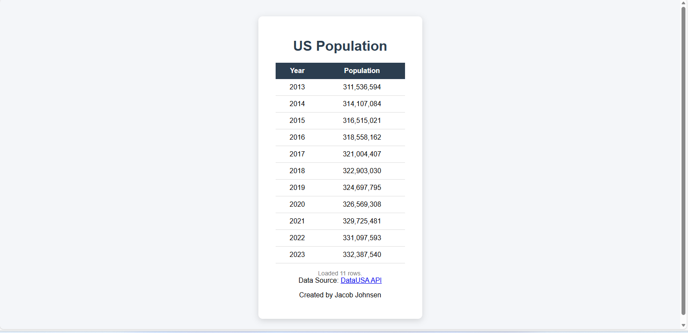

# CS-3980-Assignment-2 *Created by: Jacob Johnsen*
## US Population Table (Data USA API)

This project displays US population data by year using the Data USA API.

### Requirements Met
- Uses an IIFE pattern in JavaScript
- Uses `fetch` to retrieve data from the API
- Parses, sorts by Year, and displays results in an HTML table

### API Endpoint
https://api.datausa.io/tesseract/data.jsonrecords?cube=acs_yg_total_population_5&measures=Population&drilldowns=Year

### Screenshot

### How to Run
- Open `index.html` in a browser
- Recommended: use VS Code Live Server
